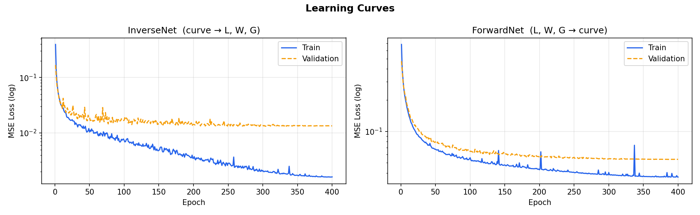
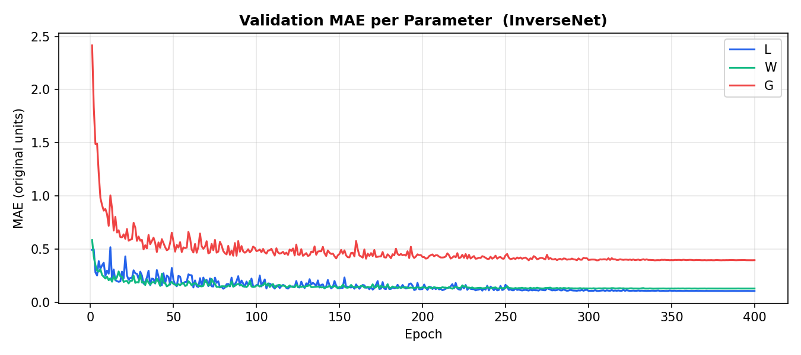
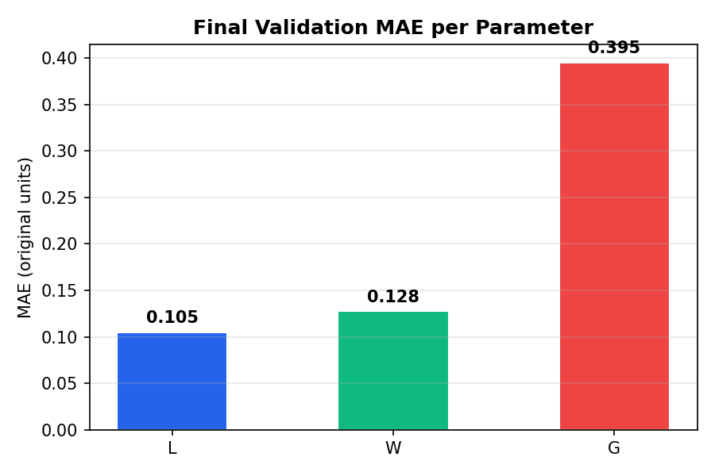

# Inverse Design Model (L, W, G Prediction)

This project predicts geometric parameters (L, W, G) from frequency response curves using a hybrid deep learning approach and compares the results with traditional machine learning models.

The workflow consists of three main stages: training, testing/optimization, and baseline ML comparison.

---

## Setup

Create a virtual environment, activate it, and install dependencies:

python -m venv venv  
venv\Scripts\activate        (Windows)  
source venv/bin/activate     (Mac/Linux)  
pip install -r requirements.txt  

---

## Workflow

### Cell 1 — Training

This step trains two neural networks:

- InverseNet → predicts (L, W, G) from input curve  
- ForwardNet → reconstructs curve from (L, W, G)  

Run:

Cell 1  

Outputs generated:

- inverse_model.pth  
- forward_model.pth  
- sx_inv.pkl, sy_inv.pkl  
- sx_fwd.pkl, sy_fwd.pkl  

---

### Training Performance

#### Learning Curves

#### Validation MAE Curve

#### Final Validation MAE

L = 0.105  
W = 0.128  
G = 0.395  

---

### Cell 2 — Testing / Optimization

This step uses the trained models to predict parameters from unseen test curves.

Process:

- Initial prediction using InverseNet  
- Refinement using Adam optimization  
- Final polishing using Nelder-Mead  

Run:

Cell 2  

Output:

- test_metrics_unclipped.txt  

Final metrics (unclipped):

MAE  : [1.0615, 0.2824, 2.7909]  
RMSE : [2.0828, 0.3921, 4.5604]  
MSE  : [4.3382, 0.1538, 20.7977]  

---

### Cell 3 — Machine Learning Baselines

This step compares deep learning results with classical ML models.

Models included:

- Random Forest  
- Gradient Boosting  
- SVR  
- KNN  
- Ridge Regression  
- Simple 1D CNN  

Run:

Cell 3  

Summary (MAE):

Random Forest        → [1.616, 1.069, 4.407]  
Gradient Boosting    → [1.384, 1.495, 5.341]  
SVR                  → [2.104, 1.148, 4.626]  
KNN                  → [1.557, 0.936, 4.392]  
Ridge                → [1.862, 4.023, 11.983]  
Simple CNN           → [0.894, 0.595, 2.648]  

---

## requirements.txt
